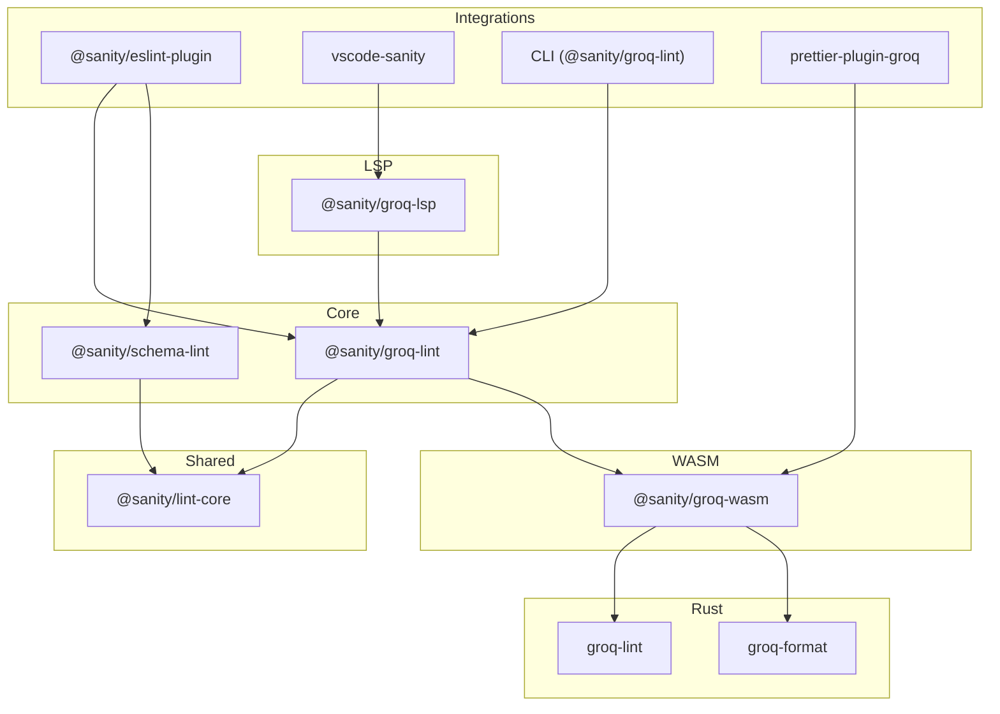

# Sanity Lint

> **🧪 Experimental** - This project is part of [Sanity Labs](https://github.com/sanity-labs).
> It's functional and useful, but not officially supported. Use at your own discretion.
> Feedback and contributions welcome!

Catch GROQ bugs and performance issues before they hit production.

This monorepo provides linting tools for Sanity projects. **With schema-aware linting enabled**, it catches typos in field names, invalid type filters, and queries that would silently return empty results. It also flags performance patterns that slow down your app at scale.

**[Try the Playground](https://sanity-lint.sanity.dev)** - Test GROQ queries against lint rules in your browser

## What's Inside

This monorepo contains linting tools for Sanity, with integrations for different development environments:

### Editor Integrations

| Package                                               | Description                                   |
| ----------------------------------------------------- | --------------------------------------------- |
| **[@sanity/eslint-plugin](./packages/eslint-plugin)** | ESLint plugin - lint rules in your IDE and CI |
| **[vscode-sanity](./packages/vscode-sanity)**         | VS Code/Cursor extension with LSP support     |
| **[@sanity/groq-lint](./packages/groq-lint)**         | Standalone CLI for linting GROQ queries       |

### Core Libraries

| Package                                                 | Description                             |
| ------------------------------------------------------- | --------------------------------------- |
| [@sanity/groq-lint](./packages/groq-lint)               | GROQ linting engine and rules           |
| [@sanity/schema-lint](./packages/schema-lint)           | Schema linting engine and rules         |
| [@sanity/groq-lsp](./packages/groq-lsp)                 | Language Server Protocol for GROQ       |
| [@sanity/lint-core](./packages/core)                    | Shared types and utilities              |
| [prettier-plugin-groq](./packages/prettier-plugin-groq) | Prettier plugin for GROQ formatting     |
| [@sanity/groq-wasm](./packages/groq-wasm)               | WASM bindings for high-performance GROQ |

## Quick Start

### ESLint Plugin (Recommended)

The easiest way to use Sanity Lint is through the ESLint plugin:

```bash
npm install @sanity/eslint-plugin --save-dev
```

```js
// eslint.config.js (ESLint 9+ flat config)
import sanity from '@sanity/eslint-plugin'

export default [
  ...sanity.configs.recommended, // ← start here
]
```

This gives you IDE integration (VS Code, Cursor, etc.) and CI linting for both GROQ queries and schema definitions.

**What you get:**

- **Correctness** (schema-aware): Catches typos, invalid fields, and type mismatches. _Requires running `npx sanity schema extract` first._
- **Performance**: Catches expensive patterns like joins in filters and deep pagination. _Works out of the box._

See the [@sanity/eslint-plugin README](./packages/eslint-plugin) for detailed setup, monorepo configuration, and rule customization.

### Standalone CLI

For linting GROQ queries without ESLint:

```bash
# Lint a query directly
npx @sanity/groq-lint -q '*[author->name == "Bob"]'

# Lint a file
npx @sanity/groq-lint query.groq

# JSON output for CI
npx @sanity/groq-lint --json query.groq
```

## Rules

**27 lint rules** (14 GROQ + 13 Schema) to catch common issues.

### GROQ Rules

| Rule                                | Severity | Description                                |
| ----------------------------------- | -------- | ------------------------------------------ |
| `groq-join-in-filter`               | error    | Avoid `->` dereferences inside filters     |
| `groq-deep-pagination`              | warn     | Avoid large slice offsets                  |
| `groq-large-pages`                  | warn     | Avoid fetching too many documents          |
| `groq-many-joins`                   | warn     | Avoid queries with many joins              |
| `groq-computed-value-in-filter`     | warn     | Avoid arithmetic in filters                |
| `groq-non-literal-comparison`       | warn     | Avoid comparing two dynamic values         |
| `groq-order-on-expr`                | warn     | Avoid ordering by expressions              |
| `groq-very-large-query`             | warn     | Query text approaching size limits         |
| `groq-extremely-large-query`        | error    | Query text exceeds safe size limits        |
| `groq-join-to-get-id`               | warn     | Unnecessary join to get `_id`              |
| `groq-repeated-dereference`         | warn     | Same reference dereferenced multiple times |
| `groq-match-on-id`                  | warn     | Using `match` on `_id` field               |
| `groq-count-in-correlated-subquery` | warn     | `count()` in correlated subquery           |
| `groq-deep-pagination-param`        | warn     | Pagination offset from parameter           |

### Schema Rules

| Rule                                 | Severity | Description                               |
| ------------------------------------ | -------- | ----------------------------------------- |
| `schema-missing-define-type`         | error    | Schema must use `defineType()`            |
| `schema-missing-define-field`        | error    | Fields must use `defineField()`           |
| `schema-reserved-field-name`         | error    | Avoid `_id`, `_type`, etc. field names    |
| `schema-missing-icon`                | warn     | Document/object types should have icons   |
| `schema-missing-title`               | warn     | Types should have titles                  |
| `schema-presentation-field-name`     | warn     | Avoid presentation-focused names          |
| `schema-missing-slug-source`         | warn     | Slug fields need `options.source`         |
| `schema-missing-required-validation` | warn     | Critical fields need validation           |
| `schema-heading-level-in-schema`     | warn     | Don't store heading levels in schema      |
| `schema-missing-description`         | off      | Fields should have descriptions           |
| `schema-boolean-instead-of-list`     | off      | Prefer `options.list` over boolean        |
| `schema-array-missing-constraints`   | off      | Arrays should have constraints            |
| `schema-unnecessary-reference`       | off      | Consider embedding instead of referencing |

## Development

### Prerequisites

- Node.js >= 20
- pnpm >= 9

### Commands

```bash
pnpm install        # Install dependencies
pnpm build          # Build all packages
pnpm test           # Run tests
pnpm lint           # Lint codebase
pnpm typecheck      # Type check
```

### Adding Rules

See [CONTRIBUTING.md](./CONTRIBUTING.md) for details on adding new lint rules.

## Architecture



The core libraries are decoupled from integrations. The LSP server provides IDE features (diagnostics, hover, completion) for any editor that supports the Language Server Protocol.

### WASM Acceleration

For maximum performance, `@sanity/groq-lint` and `prettier-plugin-groq` use WASM-compiled Rust for core operations:

- **Linting**: Pure GROQ rules run via Rust/WASM (~5-10x faster)
- **Formatting**: GROQ formatting via Rust/WASM
- **Fallback**: Automatic fallback to TypeScript if WASM unavailable

The WASM bindings wrap [groq-lint](https://github.com/atombender/groq-lint) and [groq-format](https://github.com/atombender/groq-format) without requiring users to install Rust.

## License

MIT
